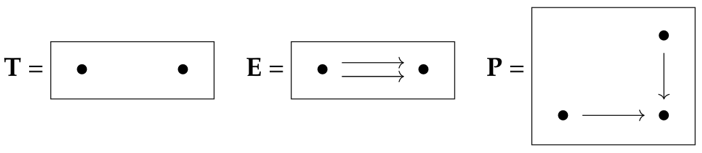

---
title:    "'Category Theory for Programmers' Companion - Part 2"
author:   Christoph Becker
date:     "2022-06-24"
keywords: [Category Theory, Haskell, Functional Programming]
book:     true
...

These notes serve the following purpose. Firstly, they list and summaries
important concepts in Category Theory and how they can be expressed in Haskell.
Secondly, the book content is compared to other books I am reading in parallel.

In composing this text I will follow these rules:
- Notes: are for references to other books and papers
- Bold font: is for definitions and questions of challenges
- Italic: If things that still need to be defined appear in text

# Table of content

11. [Declarative Programming](#11-declarative-programming)
12. [Limits and Colimits](#12-limits-and-colimits)
13. [Free Monoids](#13-free-monoids)
14. [Representable Functors](#14-representable-functors)
15. [The Yoneda Lemma](#15-the-yoneda-lemma)
16. [Yoneda Embedding](#16-yoneda-embedding)

# 0 Preface

# 11 Declarative Programming
________________________________________________________________________________

# 12 Limits and Colimits
________________________________________________________________________________

As Bartosz writes "in category theory everything is related to everything and everything can be viewed from many angles", and thus whenever a new concept is introduced it can be linked in different ways to various previously introduced concepts. In reading Bartosz's blog post I found it very helpful to read Section 8.5 of [[CH]](#CH) along side it.

This chapter advances the subjects of *products*, *coproducts*, *terminal* and *initial object* that were introduced in Section 5. Here, we will simplify and generalise the universal property of the product and coproduct through functors and natural transformations, and see reveal the deeper relation with terminal and initial objects.

Remember the definition of a product, which says that, given any pair of maps $(f: C \to X , g: C \to Y)$, there exists a unique map $C \to X \times Y$, such that certain diagrams commute. Such pair of maps is at the heart of unifying terminal objects, products of sets, preorders, categories and more. It therefore deservers another name, $\mathbf{Cone}(X, Y)$, inspired by the diagram such as Figure 5-5-1. Also, remember the definition of a diagram as given in Section 1-1.

> [[SSC]](#SSC), Definition 3.77, page 112: 
> Let $D : \mathcal{J} \to \mathcal{C}$ be a diagram. A *cone* is $(\mathcal{C}, c_*)$ over $D$ consists of 
> i) an object $C \in \mathcal{C}$, 
> ii) for each object $j \in \mathcal{J}$, a morphism $c_j: C \to D(j)$. 
> To be a cone, these must satisfy the following property:
> for each $f: j \to k$ in $\mathcal{J}$, we have $c_k = D(f) \circ c_j$.
>
> A *morphism of cones* $(C, c_{\ast})$ is a morphism $a: C \to C'$ in $\mathcal{C}$ such that for all $j \in \mathcal{J}$ we have $c_j = c_j' \circ a$. Cones over $D$, and their morphisms, form a category $\mathbf{Cone}(D)$.
>
> The *limit* of $D$, denoted as $\text{lim} D$, is the terminal object in the category $\mathbf{Cone}(D)$. Say it is the cone $\text{lim} D = (C, C_{\ast})$; we refer to $C$ as the *limit object* and the map $c_j$ for any $j \in \mathcal{J}$ as the $j$th *projection map*.

To read more on this in an applied context see [[SSC]](#SSC) Chapter 3 on databases.

Why does [[PC]](#PC) not have anything on limits?

More notes in:
- [[SSC]](#SSC), Section 3.5, page 108
- [[CH]](#CH), Section 8.5, page 89

## 12-1 Limit as a Natural Isomorphism

## 12-2 Examples of Limits

Three important examples of limits are:
- product
- equalizer
- pullback

Figure 12-1-1

## 12-3 Colimits

## 12-4 Continuity

## 12-5 Challenges

# 13 Free Monoids
________________________________________________________________________________

## 13-3 Challenges

# 14 Representable Functors
________________________________________________________________________________

## 14-3 Challenges

# 15 The Yoneda Lemma
________________________________________________________________________________

## 15-3 Challenges

# 16 Yoneda Embedding
________________________________________________________________________________

## 16-5 Challenges

### References
<a id="CM">[CM]</a>
'Conceptual Mathematics' by F. William Lawvere and Stephen H. Schanuel

<a id="SSC">[SSC]</a>
'An Invitation to Applied Category Theory: Seven Sketches in Compositionality' by Brendan Fong and David I. Spivak

<a id="PC">[PC]</a>
'Programming with Categories' by Brendan Fong, Bartosz Milewski, David I. Spivak

<a id="CH">[CH]</a>
https://github.com/jwbuurlage/category-theory-programmers by Jan-Willem Buurlage

<a id="RWH">[RWH]</a>
'Real World Haskell' by Bryan O'Sullivan, Don Stewart, John Goerzen; 2008

<a id="HPFP">[HPFP]</a>
'Haskell Programming from First Principles' by Christopher Allen and Julie Moronuki; 2016

<a id="WIWIK">[WIWIK]</a>
'What I Wish I Knew When Learning Haskell' by Stephen Diehl; 2020
